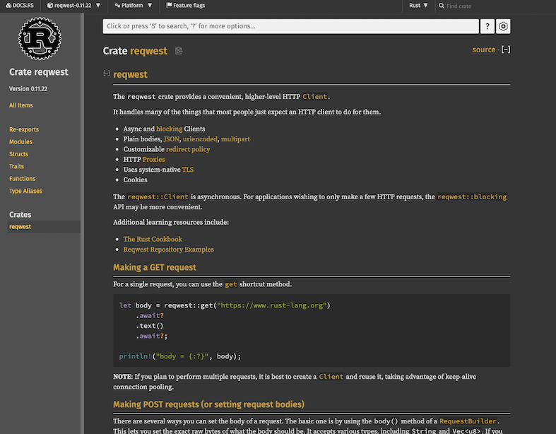

# Rust勉強会ネタだし

# 自己紹介

[自己紹介](./self_introduce.md)

# なぜRustか 
[日本語版Rust公式サイト](https://www.rust-lang.org/ja) には以下の３つが挙げられている

## パフォーマンス

> Rustは非常に高速でメモリ効率が高くランタイムやガベージコレクタがないため、パフォーマンス重視のサービスを実装できますし、組込み機器上で実行したり他の言語との調和も簡単にできます。

## 信頼性

> Rustの豊かな型システムと所有権モデルによりメモリ安全性とスレッド安全性が保証されます。さらに様々な種類のバグをコンパイル時に排除することが可能です。

## 生産性

> Rustには優れたドキュメント、有用なエラーメッセージを備えた使いやすいコンパイラ、および統合されたパッケージマネージャとビルドツール、多数のエディタに対応するスマートな自動補完と型検査機能、自動フォーマッタといった一流のツール群が数多く揃っています。

# もっとくだけた表現で説明してみる

- 実行速度
    - ガベージコレクションがない
        - かといってCやC++のようにプログラマが自分でメモリ管理するわけではない
        - 所有権という制約を課すことでコンパイル時にリソース解放のタイミングを正確に把握
    - ゼロコスト抽象化
        - ある条件を満たした列挙型をnullableポインタ最適化
        - スタック領域でメモリ確保するように最適化
        - 静的ディスパッチ
            - 参考：[https://blog.rust-jp.rs/tatsuya6502/posts/2019-12-zero-cost-abstraction/](https://blog.rust-jp.rs/tatsuya6502/posts/2019-12-zero-cost-abstraction/)
- 信頼性
    - コンパイル時に危険な動作がないかチェックしてくれる
        - nullポインタのデリファレンス
        - 未初期化メモリの参照
        - マルチスレッド特有の見つけづらいバグが起こらないことを担保
            - 所有権よって同一のメモリを複数箇所から同時に書き換えることができないないのでデータ競合が発生しない
            - dartのサンプルコード書く？
- 生産性
    - ツールが一通り揃っていて、戦争がない。
        - パッケージマネージャ・ビルドツールetc. : cargo
        - フォーマッタ: rustfmt
        - リンタ: clippy
        - LSP: rust-analyzer

# 良いところばかり紹介するのはフェアじゃないので辛みも紹介する

## コンパイルに時間がかかる

- 前述の信頼性・パフォーマンスを実現するためにコンパイル時の処理が重い。プロジェクトが大きくなるとコンパイルに時間かかる。
    - クレート分割である程度対応はできる。
    - CIはキャッシュの有効活用がキモ

## 学習コストが高い

- 2024年に向けたロードマップに掲げたテーマの一つに「学習しやすくする」を挙げている
- [https://lang-team.rust-lang.org/roadmaps/roadmap-2024.html](https://lang-team.rust-lang.org/roadmaps/roadmap-2024.html)

## 長く開発してるとローカルストレージを圧迫することがある

- `$HOME/.cargo` にクローンしたリポジトリがキャッシュされて貯まっていく
- プロジェクトの`target/debug` 配下にデバッグシンボルファイルやライブラリファイルが溜まっていく
    - `rustup self uninstall` でRustをアンインストールできます。この勉強会以降は絶対に絶対にRustは使わない人は消しておくといいかも。

# Rustを採用した企業・プロジェクト
- Linux
    - [Linuxカーネルのバージョン6.1が公開、カーネル記述にRust言語を一部採用した最初のバージョン|CodeZine（コードジン）](https://codezine.jp/article/detail/17038)
- Dropbox
    - [DropboxがコアサービスをRustで書き換えた背景とは | Think IT（シンクイット）](https://thinkit.co.jp/article/17513)
- Android
    - [「ベアメタル」環境でもRustを採用 Googleが「Android 14」での取り組みを解説 - 窓の杜](https://forest.watch.impress.co.jp/docs/news/1538800.html)
- Cloudflare
    - [Cloudflare、NGINXに代えて自社開発のRust製HTTPプロキシ「Pingora」をグローバルCDNに採用。性能向上しつつCPUとメモリ消費を3分の1に － Publickey](https://www.publickey1.jp/blog/22/cloudflarenginxrusthttppingoracdncpu31.html)
- Discord
    - [なぜDiscordはGoからRustへ移行するのか - MISONLN41's Blog](https://misonln41.hateblo.jp/entry/2020/02/12/232853)
- AWS Lambda
    - [Firecracker – サーバーレスコンピューティングのための軽量な仮想化機能 | Amazon Web Services ブログ](https://aws.amazon.com/jp/blogs/news/firecracker-lightweight-virtualization-for-serverless-computing/)


# 環境構築

- install rustup, vscode, rust-analyzer
- Rustをローカルにインストールする
    - `curl --proto '=https' --tlsv1.2 -sSf https://sh.rustup.rs | sh`　をターミナルで実行するだけ
    - [https://www.rust-lang.org/ja/learn/get-started](https://www.rust-lang.org/ja/learn/get-started)
- エディタはVSCodeを使ってください
    - もちろん自分の使い慣れてるエディタを使ってもらっても構いませんが、その場合は私がサポートできないのでトラシューは自己責任でお願いします。
- 拡張機能のrust-analyzerをインストール
    - [https://marketplace.visualstudio.com/items?itemName=rust-lang.rust-analyzer](https://marketplace.visualstudio.com/items?itemName=rust-lang.rust-analyzer)

# Hello, world

1. ターミナルで`cargo new hello-world` とするとカレントディレクトリにhello-worldディレクトリが作成されます。これがプロジェクトの雛形です。このプロジェクトをVSCodeで開いてください。
2. `src/main.rs` が起点となるファイルです。このファイルのmain()関数が実行の起点です。
3. VSCode内のターミナルから`cargo run` を実行してみてください。標準出力にビルド時のログと「Hello, world!」が表示されると思います。
4. `target/debug/hello-world` がビルドされて作成された実行ファイルです。ターミナルで`./target/debug/hello-world` を実行して「Hello, world!」が出力されるのを確認しましょう。

`cargo run --release`とするとリリースビルドになり、最適化されて実行速度が上がります。その代わりビルド時間は伸びます。`--release`オプションをつけないとデバッグビルドになる。

# cargoの使い方

- cargo check
    - 実行ファイルを生成せず、コンパイル時のチェックのみを行う。実行ファイルを生成しないためcargo buildより早い。
- cargo build
    - 実行ファイルを生成する
- cargo run
    - cargo build + 実行ファイルの実行
- cargo test
    - テストの実行（後述）

# 文法紹介・・・のその前に

Rustに限らないプログラミング言語一般のお話

1. “式”と”文”を区別してますか？ 
2. ２つのメモリ領域（スタックとヒープ）とガベージコレクション

# 式（expressions）と文（statements）

- 文とは、なんらかの動作をして値を返さない命令です。 式は結果値に評価されます。
    - ex. `if`は言語により `if”文”` だったり`if”式”`だったりする
        - Dart, C, Python は `if”文”`
        - Rustは`if“式”`
- 式の終端にセミコロンを付けたら、文になる。
- ブロックの最後ではセミコロンを省略でき、その式を戻り値として扱う

```rust
fn is_even(input: i32) -> bool {
    // if式なので、評価値を変数束縛できる
    // if式の条件式の丸括弧は不要
    let result = if input % 2 == 0 {
        return true;
    } else {
        // ブロックの最後の行のセミコロンを外すと
        // その式の評価値がそのブロックの戻り値になる
        false
				// false;　とするとコンパイルエラー
    };
    return result;
}
```

[関数 - The Rust Programming Language 日本語版](https://doc.rust-jp.rs/book-ja/ch03-03-how-functions-work.html#関数本体は文と式を含む)

# スタック（stack）とヒープ（heap）

## スタック領域（Stack）

- 高速で効率的なメモリ領域
- ローカル変数や関数呼び出しの情報を格納
- スタック上のデータはスコープを抜けると自動的に解放される
- 固定サイズで制約があり、小規模なデータに適している

## ヒープ領域（Heap）

- 動的なメモリ割り当てに使用
- メモリ確保・解放が手動で管理（ex. malloc/free）
- 大容量のデータや動的データ構造に適している
- 柔軟で容量の制約が少ない


# ガベージコレクション

Wikipediaより
[https://ja.wikipedia.org/wiki/ガベージコレクション](https://ja.wikipedia.org/wiki/%E3%82%AC%E3%83%99%E3%83%BC%E3%82%B8%E3%82%B3%E3%83%AC%E3%82%AF%E3%82%B7%E3%83%A7%E3%83%B3)

> コンピュータプログラムが動的に確保したメモリ領域のうち、不要になった領域を自動的に解放する機能である
> 

> ガベージコレクションを使用する場合、メモリを確保するコードはプログラマが明示的に記述するが、メモリの解放については明示的に記述する必要がなく、ガベージコレクタが不要と判断した時に、自動的にメモリを解放する。確保したメモリが不要かどうかは、プログラムが今後そのメモリにアクセスするかどうかで決まり、スタックや変数テーブルなどから参照をたどってメモリに到達可能かどうかによって判断される。
> 
- Stop The World
    - Full GC(ガベージコレクション)が実行されたときに、すべてのアプリケーションスレッドが停止する事象。ユーザから見るとアプリケーションが停止しているように見える。

--- 


# 変数
- 変数はデフォルトで不変（immutable）

```rust
let a = 4;

// 可変にするには mut キーワードを使う
let mut b = 10;

// これはシャドーイングなので mut は要らない
a = 7;
```

# 関数

Rustの関数と変数の命名規則はスネークケースです。関数定義は`fn`キーワードで始まり、関数名の後に丸括弧の組が続きます。
定義した関数は、名前に丸かっこの組を続けることで呼び出すことができます。 

```rust
fn main() {
    println!("Hello, world!");

    another_function();
}

fn another_function() {
    println!("Another function.");  // 別の関数
}
```

次は引数ありのパターンです。
another_functionの宣言には、`x`という名前の仮引数があります。`x`の型はi32です。

```rust
fn main() {
    another_function(5);
}

fn another_function(x: i32) {
    println!("The value of x is: {}", x);   // xの値は{}です
}
```

複数の引数を持たせたい場合は、カンマで区切ります。

```rust
fn main() {
    print_labeled_measurement(5, 'h');
}

fn print_labeled_measurement(value: i32, unit_label: char) {
    println!("The measurement is: {}{}", value, unit_label);
}
```

最後に戻り値のあるパターンです。

戻り値は矢印(->)の後に型を描きます。

```rust
fn five() -> i32 {
    5
}

fn main() {
    let x = five();

    println!("The value of x is: {}", x);
}
```

# 真偽値・数値

[サンプルコード](./examples/01_primitive.rs)

# タプル（tuple）

[サンプルコード](./examples/02_tuple.rs)

# 構造体(struct)

[サンプルコード](./examples/03_struct.rs)

# 列挙体（enum）

[サンプルコード](./examples/04_enum.rs)

# 文字・文字列

[サンプルコード](./examples/07_char_ref_str_string.rs)


# 配列・スライス・ベクタ

[サンプルコード](./examples/06_array_slice_vector.rs)


# 所有権

[所有権](./ownership.md)

# 参照と借用

[参照と借用](./reference_and_borrow.md)

<!-- TODO: -->
# ライフタイム

[ライフタイム](./lifetime.md)

# トレイト
<!-- TODO: -->

# クロージャ
<!-- TODO: -->

まだ完成してないサンプルコード

- [ ]  functional_programing
    - 所有権・ライフタイム・借用
        - 『Rust The Book』
        - 『プログラミングRust』pp 98,99
        - コンパイルエラーメッセージの読み方
        
        ```rust
        let s = vec!["a".to_string(), "b".to_string(), "c".to_string()];
        let t = s;
        let u = s;
        ```
        
        - ‘a （tick aと発音する）
        - 再帰リストとBox<T>
        - 『プログラミングRust』pp 102,103
        - 
- [ ]  trait
    - トレイト
        - `型が実装すべきメソッドを列挙して宣言したもの`
        - オブジェクト指向言語で用いられるクラスによる抽象化との比較
            - トレイトオブジェクト
        - コンパイルエラーに従って実装していく
        - 『コンセプトから理解するRust』
- [ ]  closure
    - 説明軽くで十分。型はなくて、３つのトレイトってことだけ伝える。あとmove

# マクロ

println!はマクロ。Do you know メタプログラミング？

RustのマクロはCの`#define`ような単なる文字列の置換では無い。安全に使える。

- 宣言的（declarative）マクロ
- ３種類の手続き的 (procedural) マクロ
    - deriveマクロ
    - 属性マクロ
    - 関数マクロ
- 凝ったものを作ると黒魔術しがち
    - RustのAST（抽象構文木: Abstract Syntax Tree）の知識が必要になる場合がある

## よく使うマクロ

- println!()
- format!()
- assert_eq!()
- vec![]
- #[derive()]
- panic!()
- todo!()
- unimplemented!()
- #[tokio::main]

## クレート
いわゆるライブラリとかパッケージのことをRustではクレート（crate）と呼ぶ。
プロジェクトにクレートを追加するにはCargo.tomlの`[dependencies]`にクレート名とバージョンを書く。

```toml
[dependencies]
axum = "0.6.16"
```

featureフラグは、コンパイル時にコードの一部を有効または無効にするためのメカニズム。
コードの条件付きコンパイルを可能にし、プロジェクト内で異なる機能セットを持つバージョンをビルドするのに役立つ。
featureフラグは主に次の目的で使用さる：

1. クロスプラットフォーム対応: 異なるプラットフォーム（例: Windows、Linux、macOS）でコードをビルドする場合、プラットフォーム固有の機能やライブラリの使用を切り替える
1. コードのカスタマイズ: コードベース内で異なる機能セットを持つカスタムバージョンをビルドする際に、特定の機能をオンまたはオフにする
1. テストとデバッグ: デバッグやテストのために特定の機能を有効または無効にする

featureフラグを指定するときの記法は↓

```toml
sqlx = { version = "0.7.1", features = ["sqlite", "runtime-tokio-native-tls", "chrono"] }
```

そのクレートにどんなfeatureフラグがあるかは、ドキュメントかCargo.tomlを読めば書いてある。

## 有名なクレートの紹介
### serde
シリアライズ・デシリアライズ。読み方は統一されておらず、セルデとかサーデとかシリデとか

[serde - Rust](https://docs.rs/serde/latest/serde/)

[Overview · Serde](https://serde.rs/)

```rust
use serde::{Serialize, Deserialize};

#[derive(Serialize, Deserialize, Debug)]
struct Point {
    x: i32,
    y: i32,
}

fn main() {
    let point = Point { x: 1, y: 2 };

    // Convert the Point to a JSON string.
    let serialized = serde_json::to_string(&point).unwrap();

    // Prints serialized = {"x":1,"y":2}
    println!("serialized = {}", serialized);

    // Convert the JSON string back to a Point.
    let deserialized: Point = serde_json::from_str(&serialized).unwrap();

    // Prints deserialized = Point { x: 1, y: 2 }
    println!("deserialized = {:?}", deserialized);
}
```

### chrono
日付・時刻・タイムスタンプ

[chrono - Rust](https://docs.rs/chrono/latest/chrono/)

```rust
use chrono::prelude::*;
use chrono::offset::LocalResult;


let dt = Utc.with_ymd_and_hms(2014, 7, 8, 9, 10, 11).unwrap(); // `2014-07-08T09:10:11Z`
assert_eq!(dt, NaiveDate::from_ymd_opt(2014, 7, 8)?.and_hms_opt(9, 10, 11)?.and_local_timezone(Utc).unwrap());

// July 8 is 188th day of the year 2014 (`o` for "ordinal")
assert_eq!(dt, NaiveDate::from_yo_opt(2014, 189)?.and_hms_opt(9, 10, 11)?.and_utc());
// July 8 is Tuesday in ISO week 28 of the year 2014.
assert_eq!(dt, NaiveDate::from_isoywd_opt(2014, 28, Weekday::Tue)?.and_hms_opt(9, 10, 11)?.and_utc());

let dt = NaiveDate::from_ymd_opt(2014, 7, 8)?.and_hms_milli_opt(9, 10, 11, 12)?.and_local_timezone(Utc).unwrap(); // `2014-07-08T09:10:11.012Z`
assert_eq!(dt, NaiveDate::from_ymd_opt(2014, 7, 8)?.and_hms_micro_opt(9, 10, 11, 12_000)?.and_local_timezone(Utc).unwrap());
assert_eq!(dt, NaiveDate::from_ymd_opt(2014, 7, 8)?.and_hms_nano_opt(9, 10, 11, 12_000_000)?.and_local_timezone(Utc).unwrap());

// dynamic verification
assert_eq!(Utc.with_ymd_and_hms(2014, 7, 8, 21, 15, 33),
           LocalResult::Single(NaiveDate::from_ymd_opt(2014, 7, 8)?.and_hms_opt(21, 15, 33)?.and_utc()));
assert_eq!(Utc.with_ymd_and_hms(2014, 7, 8, 80, 15, 33), LocalResult::None);
assert_eq!(Utc.with_ymd_and_hms(2014, 7, 38, 21, 15, 33), LocalResult::None);

// other time zone objects can be used to construct a local datetime.
// obviously, `local_dt` is normally different from `dt`, but `fixed_dt` should be identical.
let local_dt = Local.from_local_datetime(&NaiveDate::from_ymd_opt(2014, 7, 8).unwrap().and_hms_milli_opt(9, 10, 11, 12).unwrap()).unwrap();
let fixed_dt = FixedOffset::east_opt(9 * 3600).unwrap().from_local_datetime(&NaiveDate::from_ymd_opt(2014, 7, 8).unwrap().and_hms_milli_opt(18, 10, 11, 12).unwrap()).unwrap();
assert_eq!(dt, fixed_dt);
```

### reqwest

Httpクライアント

[reqwest - Rust](https://docs.rs/reqwest/latest/reqwest/)

```rust
let body = reqwest::get("https://www.rust-lang.org")
    .await?
    .text()
    .await?;

println!("body = {:?}", body);
```

### tokio
デファクトスタンダードな非同期ランタイム

[tokio - Rust](https://docs.rs/tokio/latest/tokio/)

[Tutorial | Tokio - An asynchronous Rust runtime](https://tokio.rs/tokio/tutorial)
```rust
use mini_redis::{client, Result};

#[tokio::main]
async fn main() -> Result<()> {
    // Open a connection to the mini-redis address.
    let mut client = client::connect("127.0.0.1:6379").await?;

    // Set the key "hello" with value "world"
    client.set("hello", "world".into()).await?;

    // Get key "hello"
    let result = client.get("hello").await?;

    println!("got value from the server; result={:?}", result);

    Ok(())
}
```

### axum
tokioと同じチームが作ったWebフレームワーク

[axum - Rust](https://docs.rs/axum/latest/axum/)

```rust
use axum::{response::Html, routing::get, Router};

#[tokio::main]
async fn main() {
    // build our application with a route
    let app = Router::new().route("/", get(handler));

    // run it
    let listener = tokio::net::TcpListener::bind("127.0.0.1:3000")
        .await
        .unwrap();
    println!("listening on {}", listener.local_addr().unwrap());
    axum::serve(listener, app).await.unwrap();
}

async fn handler() -> Html<&'static str> {
    Html("<h1>Hello, World!</h1>")
}
```
## クレートのドキュメントの読み方
ほぼ全てのクレートのドキュメントが以下の形式で提供されます。

[reqwest - Rust](https://docs.rs/reqwest/latest/reqwest/)



- ソースコードのリポジトリへのリンク
- バージョンの切り替え
- モジュール・構造体・トレイト・関数
- 検索


# Rust初心者に送る言葉

## まずはコンパイルが通るコードを書こう

- コード書く → Check On Save → エラーメッセージに従ってコード修正 → Check On Save → …
のサイクルを回す
- プログラムは動いてなんぼ。実行できなきゃ意味がない。最初から”完璧”を目指そうとしない。
- 困ったら躊躇わずにcloneを使おう
    - 慣れてきたら参照を使ってメモリ効率の良いコードを目指そう。
- 本番運用じゃなければ、Result, Optionから中身を取り出すときはunwrap() or expect()してしまおう
    - 慣れてきたらエラーハンドリングしよう
- （ある程度は）clippyがよりRustっぽい書き方を提案してくれる

# いまどきのエラーハンドリング

- 近年のデファクトスタンダード化しつつあるanyhowとthiserrorクレートを組み合わせたエラーハンドリングを教える。それを使えば簡潔に書ける。
- ファイル分割・モジュール分割
- テスト
- スレッド
    - データ競合を防ぐ仕組み
    - Arc<Mutex<T>>
- 非同期
    - Future, async, 非同期ランタイム
- 簡単なAPI Server（GETのみ）
- DBとつなぐ（docker-compose.ymlをこちらで用意する）
- sqlx追加
- tracing追加


# 今日説明しなかったこと

- バイナリクレートとライブラリクレート
- unsafe
- エディション
- async trait
- 他言語との連携（FFI）
- デバッガ（LLDB）
- マーカトレイト・Phantom Type
- Web Assembly
- const / static
- プロファイル（`cargo benchmark`）
- ドキュメント（`cargo doc`）
- クロスコンパイル
- CPU boundな場合のマルチスレッド
- OSスレッドとグリーンスレッド
- Nightly
- orphan rule
- lexical scope と non-lexical scope    
    -  [Non-Lexical Lifetimes - Qiita](https://qiita.com/_EnumHack/items/8b6ecdeb52e69a4ff384)
    

簡易curlコマンドを作る

- オプションなしで実行したらusageを表示
- `コマンド <URL>` ならURLにGETでリクエストし、ステータスコード200が返ってきたらレスポンスを標準出力に表示
- `コマンド -X POST <URL> -d <DATA>` でURLにPOSTでリクエストする。ステータスコード200が返ってきたらレスポンスを標準出力に表示
- 自分でAPIのdocumentを読んだりサンプルコードを見ながら実装する
- reqwest, clap クレートを使う
- 余裕があれば`-H “KEY:VALUE”` でヘッダを追加したり、クエリパラメータに対応したり、エラーハンドリングを追加してみる。
- `-v`や`-vvv`相当のことがしたいなら、reqwestより低レイヤーのhyperを使わないできないと思われる。
- axumでアプリ作る
    - ヘッダ・ペイロード・クエリパラメータ・メソッド・パスを標準出力
    - GETはhello worldを返すだけ
    - POSTはリクエストのフォーマットを判定してからオウム返し
        - application/json ?

# 勉強会のフォーマット

資料はGitHub上で公開

スライドはあまり枚数多くないと思う

マークダウンで教科書を書く

Zero To Productionを参考に

Windowsどうする