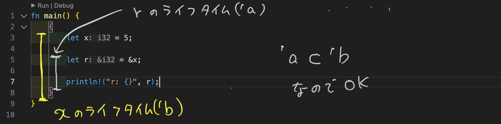

# ライフタイム

## TL;DR
- 参照が有効な期間をライフタイムという
- ライフタイムの主な目的は、ダングリング参照を回避すること
- 型推論のようにライフタイムも推論してくれるが、ときおりプログラマがライフタイムを指定する必要がある
- 型パズルならぬライフタイムパズルに苦しめられることもしばしば


## ダングリング参照（ダングリングポインタ）
[ダングリングポインタとは｜dangling pointerの危険性と回避 | MaryCore](https://marycore.jp/coding/dangling-pointer/#%E3%83%80%E3%83%B3%E3%82%B0%E3%83%AA%E3%83%B3%E3%82%B0%E3%83%9D%E3%82%A4%E3%83%B3%E3%82%BF%E3%81%AE%E4%BE%8B) より引用

解放済みのオブジェクトポインタはダングリングポインタ

```c
char *p = malloc(1); // メモリ確保
free(p);             // メモリ解放

p;        // ポインタ変数`p`は既にダングリングポインタ
*p = 'c'; // ダングリングポインタへのアクセス（危険）
```

また、寿命を迎えたオブジェクトを参照し続けているポインタも、ダングリングポインタ

```c
char *p = NULL;
{
  // 自動変数`c`の生存期間はスコープ内のみ
  char c = 'c';
  p = &c; // ローカル変数の参照を保持
}
          // ローカル変数`c`の寿命は既に尽きている
p;        // よってポインタpはダングリングポインタ
printf("%c", *p); // 不定な動作を引き起こすため危険
```

----
C言語ではダングリングポインタを含むコードをコンパイルして実行できてしまう。

Rustで似たようなコードを書いてみる。

```rust
{
    let r;

    {
        let x = 5;
        r = &x;
    }


    // 変数xの値を出力しようと試みる
    println!("r: {}", r);
}
```

外側のスコープで初期値なしの`r`という変数を宣言し、内側のスコープで初期値5の`x`という変数を宣言しています。
内側のスコープ内で、`r`の値を`x`への参照にセットしようとしています。それから内側のスコープが終わり、
`r`の値を出力しようとしています。`r`が参照している値が使おうとする前にスコープを抜けるので、
このコードはコンパイルできません。こちらがエラーメッセージです:

```
$ cargo run
   Compiling chapter10 v0.1.0 (file:///projects/chapter10)
error[E0597]: `x` does not live long enough
（エラー[E0597]: `x`の生存期間が短すぎます）
  --> src/main.rs:7:17
   |
7  |             r = &x;
   |                 ^^ borrowed value does not live long enough
   |                   (借用された値の生存期間が短すぎます)
8  |         }
   |         - `x` dropped here while still borrowed
   |          (`x`は借用されている間にここでドロップされました)
9  | 
10 |         println!("r: {}", r);
   |                           - borrow later used here
   |                            (その後、借用はここで使われています)

error: aborting due to previous error

For more information about this error, try `rustc --explain E0597`.
error: could not compile `chapter10`.

To learn more, run the command again with --verbose.
```

変数`x`の「生存期間が短すぎます」。原因は、内側のスコープが7行目で終わった時点で`x`がスコープを抜けるからです。
ですが、`r`はまだ、外側のスコープに対して有効です; スコープが大きいので、「長生きする」と言います。
Rustで、このコードが動くことを許可していたら、`r`は`x`がスコープを抜けた時に解放されるメモリを参照していることになり、
`r`で行おうとするいかなることもちゃんと動作しないでしょう。では、どうやってコンパイラはこのコードが無効であると決定しているのでしょうか？
それは、借用チェッカーを使用しているのです。

## 借用精査機（borrow checker）

ここで、`r`のライフタイムは`'a`、`x`のライフタイムは`'b`で注釈しました。ご覧の通り、
内側の`'b`ブロックの方が、外側の`'a`ライフタイムブロックよりはるかに小さいです。
コンパイル時に、コンパイラは2つのライフタイムのサイズを比較し、`r`は`'a`のライフタイムだけれども、
`'b`のライフタイムのメモリを参照していると確認します。`'b`は`'a`よりも短いので、プログラムは拒否されます:
参照の対象が参照ほど長生きしないのです。


コードを修正したので、ダングリング参照はなくなり、エラーなくコンパイルできます。

```rust
fn main() {
    {
        let x = 5;

        let r = &x;

        println!("r: {}", r);
    }
}

```



ここで`x`のライフタイムは`'b`になり、今回の場合`'a`よりも大きいです。つまり、
コンパイラは`x`が有効な間、`r`の参照も常に有効になることを把握しているので、`r`は`x`を参照できます。

## 関数シグニチャにおけるライフタイム注釈

参照を引数として、参照を返す関数を考えます。

```rust
fn pick1(x: &[i32], end: usize) -> &[i32] {
    &x[..end]
}

fn main() {
    let v1 = [1, 2, 3, 4, 5];
    let p = pick1(&v1, 2);

    for ss in p {
        println!("{}", ss);
    }
}
```


関数`pick1()`はi32型の配列の参照`x`と、usize型の`end`を引数にとり、その配列の最初から`end`個を抜き出したスライスを作成し、その参照を戻り値とする関数です。

このコードはコンパイル出来て、

```
1
2
```

という結果が得られます。

では、２つの配列に対して同様の操作を行う次のコードはどうでしょうか？

```rust
fn pick2(x: &[i32], y: &[i32], end: usize) -> (&[i32], &[i32]) {
    (&x[..end], &y[..end])
}

fn main() {
    let v1 = [1, 2, 3, 4, 5];
    let v2 = [6, 7, 8];

    let p = pick2(&v1, &v2, 2);
    for ss in p.0 {
        println!("{}", ss);
    }

    for ss in p.1 {
        println!("{}", ss);
    }
}
```

関数`pick2()`は、２つの配列の参照を引数にとり、それぞれの配列について最初から`end`個だけ取り出したスライスを作成し、それらの参照をタプルにして返却します。このコードはコンパイル出来ません。

```
error[E0106]: missing lifetime specifiers
 --> texts/examples/lifetime_05.rs:1:48
  |
1 | fn pick2(x: &[i32], y: &[i32], end: usize) -> (&[i32], &[i32]) {
  |             ------     ------                  ^       ^ expected named lifetime parameter
  |                                                |
  |                                                expected named lifetime parameter
  |
  = help: this function's return type contains a borrowed value, but the signature does not say whether it is borrowed from `x` or `y`
help: consider introducing a named lifetime parameter
  |
1 | fn pick2<'a>(x: &'a [i32], y: &'a [i32], end: usize) -> (&'a [i32], &'a [i32]) {
  |         ++++     ++            ++                         ++         ++

For more information about this error, try `rustc --explain E0106`.
error: could not compile `texts` (example "lifetime_05") due to previous error
```

エラーメッセージで重要な部分がここです。

- この関数の戻り値の型は借用された値を含んでいる。しかし、関数のシグネチャからは２つの引数`x`と`y`のどちらから借用しているのかわからない
- 名前付きのライフタイムパラメータを使うことを検討してください。

所有権と参照のところで説明したように、関数のローカル変数の参照を戻り値とすることはできないので、戻り値の参照は引数の参照を起源にしたもの（あるいは、静的領域に配置された&'staticな参照）になります。その結果、戻り値と、引数が参照する元の値が同時にメモリに存在していて破棄されていない必要があります。

上のコードの場合、`x`と戻り値のタブルの最初の成分、`y`と戻り値のタプルの２番目の成分それぞれについて、参照元の値が同時にライフタイムの中にあればOKです。

このことをコンパイラに伝えるために、名前付きのライフタイムパラメータを使って`pick2()`の定義を修正します。

```rust
fn pick2<'a, 'b>(x: &'a [i32], y: &'b [i32], end: usize) -> (&'a [i32], &'b [i32]) {
    (&x[..end], &y[..end])
}
```


'a（tick aと読む）と'bがライフタイムパラメータで、'と文字（慣例でa, b・・・が使われる）の組み合わせで表されます。可変参照の場合は`&'a mut`と表記します。

この修正をおこなったコードはコンパイル出来るようになります。

コンパイラは「戻り値のタブルの最初の成分の参照元の値と、`x`の参照元の値は同時にライフタイムの中にいて参照できる。そうであるならば、戻り値のタプルの最初の成分は`x`からのデータの一部が返却されるべき。」と解釈し、実際にその通りになっているか関数定義を検査し、そのようなコードになっていることを確認します。

仮に戻り値のタプルにつけたライフタイムパラメータを逆にするとどうなるでしょうか？

```rust
  |
1 | fn pick2<'a, 'b>(x: &'a [i32], y: &'b [i32], end: usize) -> (&'b [i32], &'a [i32]) {
  |          --  -- lifetime `'b` defined here
  |          |
  |          lifetime `'a` defined here
2 |     (&x[..end], &y[..end])
  |     ^^^^^^^^^^^^^^^^^^^^^^ function was supposed to return data with lifetime `'a` but it is returning data with lifetime `'b`
  |
  = help: consider adding the following bound: `'b: 'a`

help: `'a` and `'b` must be the same: replace one with the other

error: could not compile `texts` (example "lifetime_05") due to 2 previous errors
```

「戻り値のタプルの最初の成分はライフタイムパラメータ`'b`を持つと宣言されているが、ライフタイムパラメータ`'a`である`x`を返している。」というエラーメッセージが出力されます。

helpにあるように、ライフタイムパラメータを'aのみにしてもコンパイルは可能です。
このときは、引数の`x`と`y`、戻り値のタプルの２つの成分が同じライフタイムパラメータを持つことになります。


### ひとこと
ライフタイムパラメータが推論される場合は頭を悩ませる必要はないのですが、推論してくれないときはプログラマが自分で書くことになります。まずはエラーメッセージをしっかり読みましょう。helpに従うだけで解決する場合も多分にあります。次にライフタイムパラメータを１つだけ導入してコンパイルが通るか試してみましょう。これでコンパイルが通れば儲け物です。それでもコンパイル出来ない場合は前後のコードをじっくり読んで適切なライフタイムパラメータを設定しましょう。ライフタイムパラメータパズルがしんどい場合は、所有権のあるデータを返すことを検討しましょう。また、そもそも参照を使うべきではない箇所で参照を使ってないか設計を見直す機会かもしれません。