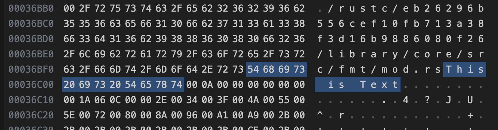

# 所有権（ownership）

## 所有権とは？
一般に全てのプログラムは、実行中にコンピュータのメモリの使用方法を管理する必要がある。以下の２つのどちらかのメモリ管理方法

1. ガベージコレクション（GC）
1. プログラマが明示的にメモリ確保・解放


Rustは第３の選択肢をとった。それが所有権システム。

所有権は多くのプログラマにとって新しい概念なので慣れるまでに時間がかかる。
所有権システムに慣れると、所有権システムのない言語でプログラムを書くときに「いま安全じゃないコード書いちゃったかも」と気付けるようになる（とRustTokyo 2023の登壇者が言っていた）

## 所有権規則

まずは、所有権のルールを紹介する。

- Rustの各値は、*所有者*と呼ばれる変数と対応している。
- いかなる時も所有者は一つである。
- 所有者がスコープから外れたら、値は破棄される。

## 変数スコープ

所有権の最初の例として、何らかの変数のスコープについて見ていきましょう。スコープとは、 要素が有効になるプログラム内の範囲のことです。以下のような変数があるとする。

```rust
let s = "hello";
```

変数`s`は、文字列リテラルを参照している。
この変数は宣言された地点から、現在のスコープの終わりまで有効になります。

```rust
{                      // sは、ここでは有効ではない。まだ宣言されていない
    let s = "hello";   // sは、ここから有効になる

    // sで作業をする
}                      // このスコープは終わり。もうsは有効ではない
```

言い換えると、ここまでに重要な点は二つあります:

- `s`がスコープに入ると、有効になる
- スコープを抜けるまで、有効なまま

ここで、スコープと変数が有効になる期間の関係は、他の言語に類似しています。さて、この理解のもとに、 String型を導入してメンタルモデルを構築していきましょう。


## ヒープにメモリを確保する場合（String型を例に）

&strはスタックにメモリが確保され、スコープが終わるとスタックから取り除かれる。

今度はヒープに確保されるデータ型の例としてString型を観察して、 コンパイラがどうそのデータを掃除すべきタイミングを把握しているかを掘り下げていく。

```rust
let s = String::from("hello");
```

String型は可変にできる。文字列リテラルの&strは可変にできない。この違いはメモリを扱う方法にある。

```rust
let mut s = String::from("hello");
s.push_str(", world!"); // push_str()関数は、リテラルをStringに付け加える
println!("{}", s); // これは`hello, world!`と出力する
```


## メモリと確保

文字列リテラル（&str）の場合、中身はコンパイル時に判明しているので、テキストは最終的なバイナリファイルに直接ハードコードされます。このため文字列リテラルは、高速で効率的になるのだが、それゆえに文字列リテラルは変更できない。

### ちょっと寄り道

実行ファイルに文字列がハードコードされていることを確認してみる。
examplesに`static-text-hard-coded`というサンプルプロジェクトがある。コードはこれだけ↓。

```rust
fn main() {
    let s = "This is Text";
    println!("{}", s);
}
```

これをコンパイルして生成された実行ファイルをバイナリエディタで開くと、確かに"This is Text"という文字列がハードコードされている。（注：アドレスは実行環境によって変わります）



寄り道終わり

----

String型では、可変かつ伸長可能な文字列をサポートするために、コンパイル時には不明な量のメモリを**ヒープ**に確保して内容を保持します。つまり:

1. メモリは、実行時にOSに要求される。
1. String型を使用し終わったら、OSにこのメモリを返還する方法が必要。


1.は`String::from()`を呼び出すことで実現される。

2.を"メモリを所有している変数がスコープを抜けたらメモリを自動的に返還する"ことで実現している。


```rust
{
    let s = String::from("hello"); // sはここから有効になる

    // sで作業をする
}   // このスコープはここでおしまい。sはもう有効ではない
```

String型が必要とするメモリをOSに返還することが自然な地点がある。それは変数`s`がスコープを抜ける時です。 

変数がスコープを抜ける時、特別な関数を呼ぶ。この関数は、`drop`と呼ばれ、 ここにString型の書き手はメモリを返還するコードを配置することができる。閉じ波括弧で自動的にdrop関数を呼び出します。

## ムーブ（move）

```rust
let s1 = String::from("hello");
let s2 = s1;
```

`let s1 = String::from("hello");`を実行した時点での変数`s1`はこのような状態です。prt, len, capacityがある方がスタックで、矢印の先がヒープです。


2行目の`let s2 = s1;`が実行されたときのメモリはどうなるでしょうか。以下のような状態を思い浮かべるかも知れません。

`s2`にはString型のデータがコピーされる。つまり、スタックにあるptr、len、 capacityをコピーし、ポインタが指すヒープ上のデータはコピーしない。


**違います**

先ほど、変数がスコープを抜けたら、Rustは自動的にdrop関数を呼び出し、 その変数が使っていたヒープメモリを片付けると述べました。しかし、上の図2は`s1`と`s2`が同じ場所を指していることを示しています。これは問題です: s2とs1がスコープを抜けたら、 両方とも同じメモリを解放しようとします。これは二重解放エラーとして知られ、以前触れたメモリ安全性上のバグの一つになります。 メモリを2回解放することは、memory corruption (訳注: メモリの崩壊。意図せぬメモリの書き換え) につながり、 セキュリティ上の脆弱性を生む可能性があります。

実際に起こることは以下の図のとおりです。
`s1`は無効化されます。これで二重解放エラーの心配は無くなります。`s2`だけが有効なので、スコープを抜けたら`s2`のメモリを解放して、 終わりになります。


試しに`let s2 = s1;`のあとに`s1`を参照してみてください。このコードはコンパイル出来ません。

```rust
let s1 = String::from("hello");
let s2 = s1;

println!("{}, world!", s1);
```

コンパイラは以下のような親切なエラーメッセージを出力してくれます。

```
error[E0382]: use of moved value: `s1`
              (ムーブされた値の使用: `s1`)
 --> src/main.rs:5:28
  |
3 |     let s2 = s1;
  |         -- value moved here
4 |
5 |     println!("{}, world!", s1);
  |                            ^^ value used here after move
  |                               (ムーブ後にここで使用されています)
  |
  = note: move occurs because `s1` has type `std::string::String`, which does
  not implement the `Copy` trait
    (注釈: ムーブが起きたのは、`s1`が`std::string::String`という
    `Copy`トレイトを実装していない型だからです)

```